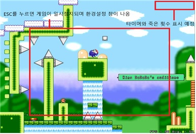

 

# [ 목차 ]

## 1. 게임명 : Diver (개발자: 박기현, 서윤성) (#1)
## 2. 관련이미지 & 동영상 (#2)
## 3. 대표 이미지 & 대표이미지 기반 작품묘사 (#3)
## 4. 컨셉 (#4)
## 5. Diver 구성 요소 (#5)
## 6. 게임시스템디자인 (#6)
## 7. 요구사항 (#7)
## 8. 시간별 흐름도 Flowchart (#8)
## 9. 키보드 이벤트에 대한 흐름도 (#9)
## 10. 용어정리 (#10)
## 11. 스토리보드 (#11)
## 12. 작업결과 (#12)

 

 

# 1. [게임명 : Diver] 

 

## 2. [관련 이미지와 동영상]
 

[이미지]  
  - 이미지 1

  

  - 이미지 2

  

[동영상]

(https://youtu.be/OH5NlNOIo7w)
 
 

## 3. [대표 이미지 그리고 컨셉과 대표이미지 기반 작품 묘사] 

[컨셉]

## 4. [컨셉]

 

### 메인컨셉 :

- 생존 기회가 1회인 캐릭터를 조작하여 피격 시 게임 오버되며
  컨트롤 실력이 곧 게임의 클리어에 영향을 끼치기 때문에 극한의 컨트롤을 요구

### 서브 컨셉 1 : 승부욕

- 극.한.의 컨트롤을 요구하는 맵을 제작하여 플레이어가 '이 맵을 깨고 싶다!' 라는  승부욕을 자극 시킬 계획

### 서브 컨셉 2 : 스테이지

- 스테이지마다 컨셉을 달리하여서 플레이어가 게임을 플레이하는데 지루함을 해소시킬 계획  
  (총 5개의 스테이지 계획 중 )

### 서브 컨셉 3 : 슈팅

- 이동이 힘든 상황에서 슈팅하여 적을 잡아야하는 상황을 임의적으로 만들어 더 극.한.의 난이도를 제공할 계획

### 서브 컨셉 4 : 보스

- 스테이지 클리어 목표를 하나 더 추가하여서 보스 패턴을 파악하는 재미와 게임이 지루해지지 않게 만들 계획

### 서브 컨셉 5 : 스토리

- 게임 진행도에 따라 점점 스토리를 오픈하여 다음 스토리에 대한 궁금증 유발 및 재미요소 추가할 계획

 

## 5. [Diver의 구성 요소]

 

### 1. 메커니즘

[도전 과제]

1. 스폰되어있는 몬스터와 함정을 피해 생존한다.

2. 각 스테이지 마지막 보스의 패턴을 파악하여 공략 후, 보스를 처치하여 스테이지를 클리어한다.

3. 스테이지 시작부터 보스 처치까지 한번도 죽지 않고 생존하여 0 데스로 클리어한다.

[재미 요소]

1. 함정과 몬스터는 정해진 위치에서 스폰되므로 수차례 도전을 통해 위치를 파악하며 스테이지를 클리어한다.

2. 보스 몬스터의 공격 패턴을 파악 후 플레이어의 플레이 스타일에 따라 보스를 공략하여 처치한다.

3. 스테이지 중간의 세이브 포인틀르 활용하여 더 효과적인 플레이를 기대 할 수 있다.

 

### 2. 이야기

[만들게 된 배경]
  
- 20살때 친구와 함께 즐겨했던 게임을 모티브로 우리의 학과 이점을 살려 이러한 느낌의 게임을 우리도 만들어 보자 라는 다짐을 한 적이 있었습니다. 마침 졸업 작품을 구상하며 프로젝트를 진행해야하니 그때 했던 다짐을 이번에 실천으로 옮길 수 있겠다 생각해 만들게 되었습니다. 저희 게임을 플레이하는 플레이어들이 극한의 피지컬과 노력을 통해 이 게임을 클리어 할 시, 큰 성취감을 느꼈으면 하는 마음입니다.

[참신함]

- 보통 비슷한 컨트롤 게임들은 카메라 시점이 캐릭터에게 고정되어 있지만, 이 게임은 카메라가 플레이어에 고정되어 있는게 아닌 플레이어가 맵을 이동할 때만 카메라 시점의 변화가 있다.

[카메라 관점]

- 카메라가 플레이어에 고정되어 있는게 아닌 플레이어가 맵을 이동할 때만 카메라 시점의 변화가 있다.

 

### 3. 미적요소

[배경] 

- 우주에서부터 지상까지의 이동을 스토리로 한 게임인만큼 우주에서는 우주배경인 검정, 대기권은 우주와 하늘의 중간쯤인 진한 파랑, 하늘은 밝은 파랑, 지상은 초록과 갈색 위주의 색다. 또한 피지컬에 따라 게임의 진행도가 크게 바뀌는만큼 최소한의 UI를 사용하여 플레이어가 본인의 기량을 더 잘 살릴 수 있도록 합니다.

[음향] 

- 피지컬의 의존도가 높은 만큼 너무 혼잡한 음악보다 음악에 따라 보스의 공격 패턴의 타이밍, 몬스터의 움직임을 공략 할 수 있도록 간략한 패턴을 가진 BGM을 사용합니다.

 

### 4. 기술

1. Unity 엔진을 사용하여 3D로 구현합니다.

2. Horizontal과 Vertical을 통해 키보드 방향키와 'Z', 'X' 키로 플레이어 캐릭터를 조작합니다.

 

## 6. [게임 디자인]

 

### 6-1. 게임 오브젝트 분해 (구성 요소 분석)

 

|연번|종류|오브젝트 이름|오브젝트 영문명|사용처|오브젝트 이미지|
|:----:|:----:|:----:|:----:|:----:|:----:|
|01|플레이어|닐|Nill|공통||
|02|몬스터|로봇|Robot|스테이지 2 중간지점||
|03|몬스터|비행기|Plane|스테이지 3 중간지점||
|04|몬스터|새|Bird|스테이지 4 중간지||
|05|몬스터|늑대|Wolf|스테이지 5 중간지점||
|06|트랩|함정|Trap|공통||
|07|보스|오류기계|ErrorBot|스테이지 1 최종지점||
|08|보스|쓰레기로봇|TrashBot|스테이지 2 최종지점||
|09|보스|전투기|CombatPlane|스테이지 3 최종지점||
|10|보스|매|Falcon|스테이지 4 최종지점||
|11|보스|인간|Human|스테이지 5 최종지점||
|12|세이브포인트|저장|Save|공||
|13|총알|총알|Bullet|'X'키 사용시||
|14|UI|시작버튼|StartButton|게임 시작 시||
|15|UI|설정|Setting|사용 시||
|16|UI|재시작 버튼|RestartButton|'R'키 사용시||

 

### 6-2. 피라미터(속성) 뽑아 보기

 

1) 오브젝트 이름 : Nill

|속성|영문명칭|설명|비고|
|:----:|:----:|:----:|:----:|
|체력|P_Hp|플레이어의 캐릭터의 체력 수치||
|이동속도|P_Speed|플레이어의 캐릭터의 이동 속도||
|색|P_Col|플레이어 캐릭터 피격 시 색 변화||
|상태|P_Status|플레이어 캐릭터의 행동 상태 (이동, 점프, 사망 등)||

 

2) 오브젝트 이름 : Robot (Stage2 monster)

|속성|영문명칭|설명|비고|
|:----:|:----:|:----:|:----:|
|이동속도|M2_Speed|몬스터의 이동 속도||
|상태|M2_Status|몬스터의 행동 상태 (이동, 공격)||

 

3) 오브젝트 이름 : Plane (Stage3 monster)

|속성|영문명칭|설명|비고|
|:----:|:----:|:----:|:----:|
|이동속도|M3_Speed|몬스터의 이동 속도||
|상태|M3_Status|몬스터의 행동 상태 (이동, 공격)||

 

4) 오브젝트 이름 : Bird (Stage4 monster)

|속성|영문명칭|설명|비고|
|:----:|:----:|:----:|:----:|
|이동속도|M4_Speed|몬스터의 이동 속도||
|상태|M4_Status|몬스터의 행동 상태 (이동, 공격)||

 

5) 오브젝트 이름 : Wolf (Stage5 monster)

|속성|영문명칭|설명|비고|
|:----:|:----:|:----:|:----:|
|이동속도|M5_Speed|몬스터의 이동 속도||
|상태|M5_Status|몬스터의 행동 상태 (이동, 공격)||

 

6) 오브젝트 이름 : Trap

|속성|영문명칭|설명|비고|
|:----:|:----:|:----:|:----:|
|이동속도|Trap_Speed|트랩의 이동 속도||
|상태|Trap_Status|트랩의 행동 상태 (이동, 피격, 발사)||

 

7) 오브젝트 이름 : ErrorBot (Stage1 Boss)

|속성|영문명칭|설명|비고|
|:----:|:----:|:----:|:----:|
|체력|B1_Hp|보스1 체력 수치||
|이동속도|B1_Speed|보스1 이동 속도||
|공격|B1_Dmg|보스1 대미지||
|상태|B1_Status|보스1 행동 상태 (패턴1, 패턴2 등)||
|컬러|B1_Col|보스1 색상||

 

8) 오브젝트 이름 : TrashBot (Stage2 Boss)

|속성|영문명칭|설명|비고|
|:----:|:----:|:----:|:----:|
|체력|B2_Hp|보스2 체력 수치||
|이동속도|B2_Speed|보스2 이동 속도||
|공격|B2_Dmg|보스2 대미지||
|상태|B2_Status|보스2 행동 상태 (패턴1, 패턴2 등)||
|컬러|B2_Col|보스2 색상||

 

9) 오브젝트 이름 : CombatPlane (Stage3 Boss)

|속성|영문명칭|설명|비고|
|:----:|:----:|:----:|:----:|
|체력|B3_Hp|보스3 체력 수치||
|이동속도|B3_Speed|보스3 이동 속도||
|공격|B3_Dmg|보스3 대미지||
|상태|B3_Status|보스3 행동 상태 (패턴1, 패턴2 등)||
|컬러|B3_Col|보스3 색상||

 

10) 오브젝트 이름 : Falcon (Stage4 Boss)

|속성|영문명칭|설명|비고|
|:----:|:----:|:----:|:----:|
|체력|B4_Hp|보스4 체력 수치||
|이동속도|B4_Speed|보스4 이동 속도||
|공격|B4_Dmg|보스4 대미지||
|상태|B4_Status|보스4 행동 상태 (패턴1, 패턴2 등)||
|컬러|B4_Col|보스4 색상||

 

11) 오브젝트 이름 : Human (Stage5 Boss)

|속성|영문명칭|설명|비고|
|:----:|:----:|:----:|:----:|
|체력|B5_Hp|보스5 체력 수치||
|이동속도|B5_Speed|보스5 이동 속도||
|공격|B5_Dmg|보스5 대미지||
|상태|B5_Status|보스5 행동 상태 (패턴1, 패턴2 등)||
|컬러|B5_Col|보스5 색상||

 

12) 오브젝트 이름 : Bullet

|속성|영문명칭|설명|비고|
|:----:|:----:|:----:|:----:|
|공격|B_Hp|플레이어가 사용 할 총알의 대미지||
|속도|B_Speed|플레이어가 사용 할 총알의 속도||
|상태|B_Status|플레이어가 사용 할 총알의 상태 (destroy)||

 

13) 오브젝트 이름 : SavePoint

|속성|영문명칭|설명|비고|
|:----:|:----:|:----:|:----:|
|비활성화|SaveOff|총알을 맞지 않고 저장 전 상태||
|활성화|SaveOn|총알을 맞아 저장된 상태||

 

14) 오브젝트 이름 : StartButton

|속성|영문명칭|설명|비고|
|:----:|:----:|:----:|:----:|
|비활성화|StartOff|시작 버튼 활성화 전||
|활성화|StartOn|시작 버튼 활성화 후||

 

15) 오브젝트 이름 : Setting

|속성|영문명칭|설명|비고|
|:----:|:----:|:----:|:----:|
|비활성화|SettingOff|환경설정 버튼 활성화 전||
|활성화|SettingOn|환경설정 버튼 활성화 후||
|BGM비활성화|BgmOff|BGM 소리 끄기||
|BGM활성화|BgmOn|BGM 소리 켜기||
|화면 이동|GoMain|메인화면으로 이동||

 

16) 오브젝트 이름 : RestartButton

|속성|영문명칭|설명|비고|
|:----:|:----:|:----:|:----:|
|비활성화|RestartOff|재시작 버튼 활성화 전||
|활성화|RestartOn|재시작 버튼 활성화 후||

 

### 6-3. 행동 뽑아 보기

 

1) 오브젝트 이름 : Nill

|행동|영문명칭|설명|
|:----:|:----:|:----:|
|우측으로 이동|MoveRight|(→) 키 다운 시 우측으로 이동|
|좌측으로 이동|MoveLeft|(←) 키 다운 시 좌측으로 이동|
|점프|Jump|(Z) 키 다운 시 점프|
|공격|Attack|(X) 키 다운 시 Bullet 발사 (공격)|

 

2) 오브젝트 이름 : Robot

|행동|영문명칭|설명|
|:----:|:----:|:----:|
|일반공격|M2_Attack|플레이어 캐릭터와 충동 시 공격|
|이동|M2_Move|정해진 범위 안에서 좌, 우로 이동|

 

3) 오브젝트 이름 : Plane

|행동|영문명칭|설명|
|:----:|:----:|:----:|
|일반공격|M3_Attack|플레이어 캐릭터와 충동 시 공격|
|이동|M3_Move|정해진 범위 안에서 좌, 우로 이동|

 

4) 오브젝트 이름 : Bird

|행동|영문명칭|설명|
|:----:|:----:|:----:|
|일반공격|M4_Attack|플레이어 캐릭터와 충동 시 공격|
|이동|M4_Move|정해진 범위 안에서 좌, 우로 이동|

 

5) 오브젝트 이름 : Wolf

|행동|영문명칭|설명|
|:----:|:----:|:----:|
|일반공격|M5_Attack|플레이어 캐릭터와 충동 시 공격|
|이동|M5_Move|정해진 범위 안에서 좌, 우로 이동|

 

6) 오브젝트 이름 : ErrorBot

|행동|영문명칭|설명|
|:----:|:----:|:----:|
|일반공격|B1_Attack|1 스테이지 보스의 일반 공격|
|공격패턴1|B1_Pattern1|1 스테이지 보스의 패턴 공격 1|
|공격패턴2|B1_Pattern2|1 스테이지 보스의 패턴 공격 2|
|랜덤공격|B1_Rantack|1 스테이지 보스의 랜덤 공격|

 

7) 오브젝트 이름 : TrashBot

|행동|영문명칭|설명|
|:----:|:----:|:----:|
|일반공격|B2_Attack|2 스테이지 보스의 일반 공격|
|공격패턴1|B2_Pattern1|2 스테이지 보스의 패턴 공격 1|
|공격패턴2|B2_Pattern2|2 스테이지 보스의 패턴 공격 2|
|랜덤공격|B2_Rantack|2 스테이지 보스의 랜덤 공격|

 

8) 오브젝트 이름 : CombatPlane

|행동|영문명칭|설명|
|:----:|:----:|:----:|
|일반공격|B3_Attack|3 스테이지 보스의 일반 공격|
|공격패턴1|B3_Pattern1|3 스테이지 보스의 패턴 공격 1|
|공격패턴2|B3_Pattern2|3 스테이지 보스의 패턴 공격 2|
|랜덤공격|B3_Rantack|3 스테이지 보스의 랜덤 공격|

 

9) 오브젝트 이름 : Falcon

|행동|영문명칭|설명|
|:----:|:----:|:----:|
|일반공격|B4_Attack|4 스테이지 보스의 일반 공격|
|공격패턴1|B4_Pattern1|4 스테이지 보스의 패턴 공격 1|
|공격패턴2|B4_Pattern2|4 스테이지 보스의 패턴 공격 2|
|랜덤공격|B4_Rantack|4 스테이지 보스의 랜덤 공격|

 

10) 오브젝트 이름 : Human

|행동|영문명칭|설명|
|:----:|:----:|:----:|
|일반공격|B5_Attack|5 스테이지 보스의 일반 공격|
|공격패턴1|B5_Pattern1|5 스테이지 보스의 패턴 공격 1|
|공격패턴2|B5_Pattern2|5 스테이지 보스의 패턴 공격 2|
|랜덤공격|B5_Rantack|5 스테이지 보스의 랜덤 공격|

 

### 6-4. 상태 뽑아 보기

 

1) 오브젝트 이름 : Nill

|현상태|전의상태|전이조건|
|:----:|:----:|:----:|
|기본상태|아무 행동도 하지 않음|
|기본상태|앞으로 이동|→ 키에 대응하는 버튼|
|기본상태|뒤로 이동|← 키에 대응하는 버튼|
|기본상태|점프|Z 키에 대응하는 버튼|
|기본상태|공격|X 키에 대응하는 버튼|
|모든 상태 (사망 제외)|사망|함정에 피격 시|
|모든 상태 (사망 제외)|사망|몬스터에게 피격 시|
|모든 상태 (사망 제외)|사망|보스 몬스터에게 피격 시|

 

2) 오브젝트 이름 : Monster (Robot, Plane, Bird, Wolf)

|현상태|전의상태|전이조건|
|:----:|:----:|:----:|
|이동|기본으로 정해진 경로를 이동함||
|이동|공격|플레이어가 일정 범위내로 근접하였을 시 공격함|

 

3) 오브젝트 이름 : Boss (ErrorBot, TrashBot, CombatPlane, Falcon, Human)

|현상태|전의상태|전이조건|
|:----:|:----:|:----:|
|이동|기본으로 정해진 경로를 이동함||
|이동|일반공격|플레이어가 근접하였을 때 가해지는 일반공격|
|이동|공격패턴1|일정시간이 지나면 정해진 공격패턴1을 취함|
|이동|공격패턴2|일정시간이 지나면 정해진 공격패턴2을 취함|
|이동, 일반공격, 공격패턴|랜덤공격|이동, 일반공격, 공격패턴 사이에 랜덤공격이 가해짐|
|이동, 일반공격, 공격패턴|사망|체력이 0이 되었을 시, 하는 행동을 멈추고 사망|

 

### 6-5. 플레이어 캐릭터 속성(파라미터)

 

|속성|영문명칭|설명|비고]
|:----:|:----:|:----:|:----:|
|닐|Nill|우주 정거장에서 탈출한 로봇 닐, 우주선 방비 로봇이였던 만큼 손에 레이저 총 하나 밖에 없다.|약함|

 

### 6-6. 게임의 규칙

 

1) 핵심 규칙

- 유저는 Nill이라는 캐릭터로 플레이하게됨.
- 스테이지 안 함정 또는 몬스터를 피해 보스 몬스터를 잡으면 스테이지 클리어가 되고, 
- 5 스테이지 보스까지 잡을 시 게임 클리어가 됨.
- 플레이어는 플레이 중 한번이라도 피격 시 그대로 사망하기 때문에 한번도 피격하지 않고 ← (좌), → (우), Z (점프), X (공격) 키를 잘 활용 
  하여 모든 함정과 몬스터, 그리고 보스 몬스터의 공격 등을 다 회피하여 클리어 해야하는데, 스테이지의 함정의 위치와 보스 몬스터의 패턴을  
  다 파악해야하는 만큼 중간에 세이브 포인트가 배치 되어있고, 보스 스테이지 앞에는 항상 세이브 포인트가 존재.

2) 보조 규칙
- 동시에 히트되어 쓰러지더라도 보스의 사망 애니메이션 출력이 끝나기 전까지는 클리어가 아님.

 

### 6-7 게임에서 사용될 공식

 

- 함정은 플레이어가 일정 범위안에 들어왔을 때 발동함
- 몬스터는 플레이어가 일정 범위안에 들어왔을 때 공격함
  
 

## 7. [요구사항]

 

● 시작화면, 게임화면, 설정화면으로 총 3개의 화면이 있다.  
● 시작화면에는 시작하기, 설정 2개의 버튼이 있다.  
● ESC 키를 누르면 설정 화면이 나온다.  
● ESC 키를 한번 더 누르면 설정 화면이 닫힌다.  
● 설정화면에서는 사운드 바와 조작법 설명이 있다.  
● 사운드 바는 마우스로 조절이 가능하다.  
● 조작법 설명에는 Z, X, R키를 누르면 점프, 공격, 다시하기가 가능하다고 써있다.  
● 시작하기 키(space bar)를 입력하면 시작화면에서 인게임 화면으로 이동한다.  
● 게임화면에서는 플레이어 캐릭터가 있으며 →, ←를 통해 좌, 우측으로 이동한다.  
● 플레이어는 트랩에 닿을 시 사망한다.  
● 난이도 상승에 따라 몬스터와 보스가 등장한다.  
● 몬스터는 이동하고 공격하지만 캐릭터가 몬스터를 처치하는건 불가능하며 회피해야 한다.  
● 보스는 매 스테이지 후반부 보스룸으로 입장하는 포탈을 통해 이동시 등장한다.  
● 보스의 체력은 중앙 상단에 체력바로 확인 가능하다.  
● 각 스테이지 보스별 공격 패턴은 재도전해도 일치하다.  
● 보스는 총알로 보스를 공격해 보스의 체력이 0이되면 처치가 완료된다.  
● 조작은 키보드 Z키를 누르면 캐릭터가 위로 1값만큼 점프한다.  
● 키보드 Z키를 점프상태에서 한 번 더 누르면 캐릭터가 한번 더 점프한다.  
● 키보드 X키를 누르면 플레이어가 바라보는 위치로 총알을 발사한다.  
● 키보드 R키를 누르면 사망상태에서 부활하여 게임이 다시시작된다.  
● 게임이 다시시작 될 때, savepoint 지점에서 부활하게된다.  
● 첫 시작으로 savepoint가 없을 시 맨 처음부터 시작한다.  
● 게임화면에서 사망 시 R키를 누르면 재시작이 가능하다는 텍스트가 출력된다.  
● 게임화면 우측 상단에 현재 스테이지의 정보 텍스트가 출력된다.  
● 스테이지 정보 텍스트 우측에 현재까지 사망 횟수를 알리는 텍스트가 출력된다.  

 

## 8. [시간별 흐름도 flowchart]

 

 

## 9. [키보드 이벤트에 대한 흐름도]

 

 

## 10. [용어정리]

 

|Num|화면||용어|설명|
|:----:|:----:|:----:|:----:|:----:|
|1|Index(시작화면)|||Diver 게임 시작 시 첫 화면, 시작하기, 설정이 있다.|
|2|Index(시작화면)|화면요소|타이틀|게임의 타이틀인 'Diver'|
|3|Index(시작화면)|화면요소|시작하기 버튼|클릭 시 게임화면으로 이동한다.|
|4|Index(시작화면)|화면요소|설정하기 버튼|클릭 시 설정 창으로 이동한다.|
|5|Setting(설정화면)|게임 설정 화면|||
|6|Setting(설정화면)|화면요소|음향 설정|사운드 바를 이용하여 게임 음향 설정이 가능하다.|
|7|Setting(설정화면)|화면요소|뒤로가기 버튼|클릭 시 시작화면으로 이동한다.|
|8|Setting(설정화면)|스크립트 요소|AudioListener|Controls the game sound volume (0.0 to 1.0).|
|9|Setting(설정화면)|스크립트 요소|audio|AudioMixer에서 지정한 값|
|10|Setting(설정화면)|스크립트 요소|volume|0부터 1까지 소리 크기를 조절한다.|
|11|Play(게임화면)|||인게임 화면이다. 스크렉 섹션, Boss 정보 섹션이 있다.|
|12|Play(게임화면)|화면요소|사망 횟수|화면 우측 위에 사망 횟수 text가 있다.|
|13|Play(게임화면)|화면요소|Stage 정보|화면 우측 위에 현재 Stage를 알리는 text가 있다.|
|14|Play(게임화면)|화면요소|Boss 체력 바|화면 중앙 위에 Boss의 체력 바가 있다.|
|15|Play(게임화면)|화면요소|키 설명|게임에서 사용하는 키를 설명해 놓은 목록이다.|
|16|Play(게임화면)|화면요소|SavePoint|게임 진행에 따라 현재 위치를 저장하는 박스이다.|
|17|Play(게임화면)|화면요소|플레이어|게임에서 조작하는 플레이어 캐릭터이다.|
|18|Play(게임화면)|화면요소|몬스터|플레이어를 방해하는 몬스터이다.|
|19|Play(게임화면)|화면요소|트랩|플레이어가 닿으면 사망하는 트랩이다.|
|20|Play(게임화면)|화면요소|블록|플레이어가 이동 할 수 있는 박스이다.|
|21|Play(게임화면)|화면요소|다시하기|‘R’를 누르면 다시하기가 가능하다는 text이다.|
|22|Play(게임화면)|스크립트 요소|LEFT|왼쪽 이동 방향키이다. 코드 37|
|23|Play(게임화면)|스크립트 요소|RIGHT|오른쪽 이동 방향키이다. 코드 39|
|24|Play(게임화면)|스크립트 요소|ESC|ESC키 코드 27.|
|25|Play(게임화면)|스크립트 요소|Z|Z키(위로 점프) 코드 122|
|26|Play(게임화면)|스크립트 요소|X|X키(공격) 코드 120|
|27|Play(게임화면)|스크립트 요소|R|R키(다시시작) 코드 114|
|28|Play(게임화면)|스크립트 요소|Text_Death|사망 횟수를 저장하는 배열이다.|
|29|Play(게임화면)|스크립트 요소|Text_Stage|현재 Stage 정보를 저장하는 배열이다.|
|30|Play(게임화면)|스크립트 요소|Boss1_HP|1 스테이지 보스의 체력이다. int|
|31|Play(게임화면)|스크립트 요소|Boss2_HP|2 스테이지 보스의 체력이다. int|
|32|Play(게임화면)|스크립트 요소|Boss3_HP|3 스테이지 보스의 체력이다. int|
|33|Play(게임화면)|스크립트 요소|Boss4_HP|4 스테이지 보스의 체력이다. int|
|34|Play(게임화면)|스크립트 요소|Boss5_HP|5 스테이지 보스의 체력이다. int|
|35|Play(게임화면)|스크립트 요소|Savepoint|현재 위치를 저장하는 데이터이다.|
|36|Play(게임화면)|스크립트 요소|GameBgm|인게임에서 출력되는 배경음악|
|37|Play(게임화면)|스크립트 요소|Jump_Count|점프 횟수 카운트 (2회 점프시 더 못하도록한다)|
|38|Play(게임화면)|스크립트 요소|Jump_Item|점프 1회 가능한 아이템을 저장하는 오브젝트 변수이다.|
|39|Play(게임화면)|스크립트 요소|Boss1_Attack|1 스테이지 보스의 기본 공격력을 저장하는 변수이다. int|
|40|Play(게임화면)|스크립트 요소|Boss2_Attack|2 스테이지 보스의 기본 공격력을 저장하는 변수이다. int|
|41|Play(게임화면)|스크립트 요소|Boss3_Attack|3 스테이지 보스의 기본 공격력을 저장하는 변수이다. int|
|42|Play(게임화면)|스크립트 요소|Boss4_Attack|4 스테이지 보스의 기본 공격력을 저장하는 변수이다. int|
|43|Play(게임화면)|스크립트 요소|Boss5_Attack|5 스테이지 보스의 기본 공격력을 저장하는 변수이다. int|
|44|Play(게임화면)|스크립트 요소|Boss1_PA1|1 스테이지 보스의 패턴1 공격을 저장하는 변수이다.|
|45|Play(게임화면)|스크립트 요소|Boss1_PA2|1 스테이지 보스의 패턴2 공격을 저장하는 변수이다.|
|46|Play(게임화면)|스크립트 요소|Boss2_PA1|2 스테이지 보스의 패턴1 공격을 저장하는 변수이다.|
|47|Play(게임화면)|스크립트 요소|Boss2_PA2|2 스테이지 보스의 패턴2 공격을 저장하는 변수이다.|
|48|Play(게임화면)|스크립트 요소|Boss3_PA1|3 스테이지 보스의 패턴1 공격을 저장하는 변수이다.|
|49|Play(게임화면)|스크립트 요소|Boss3_PA2|3 스테이지 보스의 패턴2 공격을 저장하는 변수이다.|
|50|Play(게임화면)|스크립트 요소|Boss4_PA1|4 스테이지 보스의 패턴1 공격을 저장하는 변수이다.|
|51|Play(게임화면)|스크립트 요소|Boss4_PA2|4 스테이지 보스의 패턴2 공격을 저장하는 변수이다.|
|52|Play(게임화면)|스크립트 요소|Boss5_PA1|5 스테이지 보스의 패턴1 공격을 저장하는 변수이다.|
|53|Play(게임화면)|스크립트 요소|Boss5_PA2|5 스테이지 보스의 패턴2 공격을 저장하는 변수이다.|
|54|Play(게임화면)|스크립트 요소|Boss1_RA|1 스테이지 보스의 랜덤 공격을 저장하는 변수이다.|
|55|Play(게임화면)|스크립트 요소|Boss2_RA|2 스테이지 보스의 랜덤 공격을 저장하는 변수이다.|
|56|Play(게임화면)|스크립트 요소|Boss3_RA|3 스테이지 보스의 랜덤 공격을 저장하는 변수이다.|
|57|Play(게임화면)|스크립트 요소|Boss4_RA|4 스테이지 보스의 랜덤 공격을 저장하는 변수이다.|
|58|Play(게임화면)|스크립트 요소|Boss5_RA|5 스테이지 보스의 랜덤 공격을 저장하는 변수이다.|
|59|Play(게임화면)|스크립트 요소|Trap|트랩과 충돌 시 사망하도록 저장하는 변수이다.|
|60|Play(게임화면)|스크립트 요소|MovingTrap|움직이는 트랩 값을 저장하는 위치값 배열이다.|
|61|Play(게임화면)|스크립트 요소|isPlay|play일때 true, pause일때 false 값인 play, pause의 값.|
|62|Play(게임화면)|스크립트 요소|state|게임의 상태를 저장한 배열이다. |
|63|Play(게임화면)|스크립트 요소|Block|플레이어가 이동 가능한 블록 배열이다.|
|64|Play(게임화면)|스크립트 요소|MovingBlock|움직이는 블록 값을 저장하는 배열이다.|
|65|Play(게임화면)|스크립트 요소|Monster2|2 스테이지 몬스터 이동값을 저장하는 변수이다.|
|66|Play(게임화면)|스크립트 요소|Monster3|3 스테이지 몬스터 이동값을 저장하는 변수이다.|
|67|Play(게임화면)|스크립트 요소|Monster4|4 스테이지 몬스터 이동값을 저장하는 변수이다.|
|68|Play(게임화면)|스크립트 요소|Monster5|5 스테이지 몬스터 이동값을 저장하는 변수이다.|
 

## 11. [스토리보드]

 

 

 

 

 

 

 

## 12. [작업 결과]
