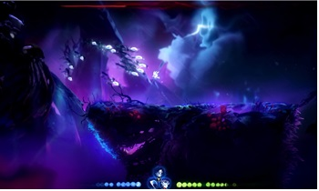
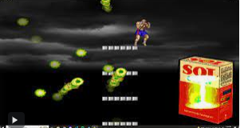

프로젝트명 : Diver
==================
# [컨셉]

## 메인컨셉 :  
-컨트롤 : 생존 기회가 1회인 캐릭터를 조작하여 피격시 게임 오버되며  
컨트롤 실력이 곧 게임의 클리어에 영향을 끼치기 때문에 극한의 컨트롤을 요구
## 서브 컨셉 1 :  
-승부욕 : 극.한.의 컨트롤을 요구하는 맵을 제작하여 플레이어가 '이 맵을 깨고 싶다!' 라는  승부욕을 자극 시킬 계획
## 서브 컨셉 2 :  
-스테이지 : 스테이지마다 컨셉을 달리하여서 플레이어가 게임을 플레이하는데 지루함을 해소시킬 계획  
(총 5개의 스테이지 계획 중 )
## 서브 컨셉 3 :  
-슈팅 : 이동이 힘든 상황에서 슈팅하여 적을 잡아야하는 상황을 임의적으로 만들어 더 극.한.의 난이도를 제공할 계획  
(횡 스크롤 게임으로 플레이어가 신경써야될 움직임은 상 하 좌 우 밖에 없다.)
## 서브 컨셉 4 :  
-보스 : 스테이지 클리어 목표를 하나 더 추가하여서 보스 패턴을 파악하는 재미와 게임이 지루해지지 않게 만들 계획  
## 서브 컨셉 5 :  
-스토리: 게임 진행도에 따라 점점 스토리를 오픈하여 다음 스토리에 대한 궁금증 유발 및 재미요소 추가할 계획
  
# [관련 이미지 & 동영상]  
-이미지  
  
-동영상
